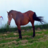
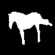
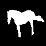

# Use Unet++ to Train Weizmann-Horse Database

          

UNET + + is used as the semantic segmentation of medical images. In this task, semantic segmentation is performed on Weizmann-Horse dataset, and Miou and BIOU are obtained


UNet++：[UNet++: Redesigning Skip Connections to Exploit Multiscale Features in Image Segmentation](https://ieeexplore.ieee.org/abstract/document/8932614 )

***

## Installation

My code has been tested on Python 3.7.4 and PyTorch1.1.0. Please follow the official instructions to configure your environment. 

***

## Model

I have trained a model, please click the link to get
**Extraction code**：hust

[Unet_Plus_Plus_model.pth](https://pan.baidu.com/s/14PdvvrAziTk_G1m26RvaXQ )


***
## Prepare Your Data
1. Please obtain[ Weizmann horse dataset](https://www.kaggle.com/datasets/ztaihong/weizmann-horse-database/metadata )
2. This dataset contains 327 pictures of horses and 327 pictures of masks
3. I divided the data set into 85% training set and 15% test set.I divided the data set into 85% training set and 15% test set. You can change the ratio of the training set and the test set through the ratio in the **predict.py**
4. The final path structure used in my code looks like this:
    ```
    $root/
    ├──── horse
    │    ├──── horse001.png
    │    ├──── horse002.png
    │    └──── ...
    ├──── mask
    │    ├──── horse001.png
    │    ├──── horse002.png
    │    └──...
    ```
***
## Training
Run the following command to train UNet++:
```
python train.py
```
-   `--imagef`should be modified to your dataset directory.
-   `--outf`should be modified to your output directory.
-   `--modelf`should be modified to your model directory.

***
## Predict
You can run predict.py to get the prediction picture of the current test set.
```
python predict.py
```
In one of my tests, **mIoU of 0.921** and **Boundary IoU of 0.679** were obtained
The prediction results are in the predict folder.

***

## Permission and Disclaimer

This code is only for non-commercial purposes. As covered by the ADOBE IMAGE DATASET LICENSE AGREEMENT, the trained models included in this repository can only be used/distributed for non-commercial purposes. Anyone who violates this rule will be at his/her own risk.
